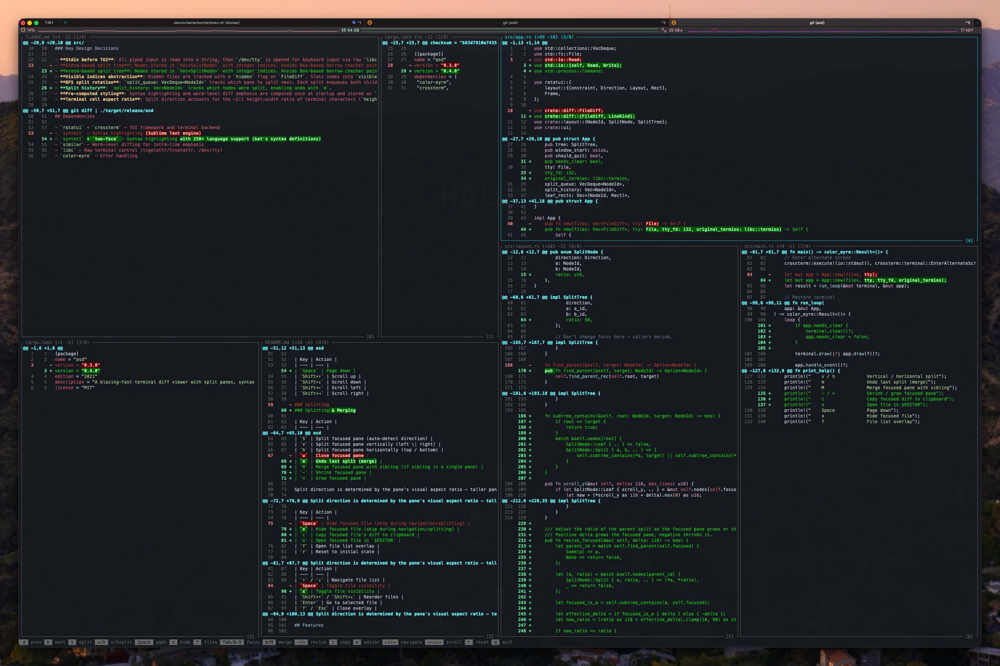

# asd

A blazing-fast terminal diff viewer with split panes, syntax highlighting, and word-level change detection.

Pipe any unified diff into `asd` and get a rich, navigable TUI for reviewing changes.



## Installation

### Cargo (from source)

```sh
cargo install asd
```

### Homebrew

```sh
brew install vdeantoni/tap/asd
```

### Prebuilt binaries

Download a binary from the [latest GitHub release](https://github.com/vdeantoni/asd/releases/latest).

## Usage

```sh
# Review git changes
git diff | asd

# Compare two files
diff -u old.txt new.txt | asd

# Run without args for a built-in demo
asd
```

## Keybindings

### Navigation

| Key | Action |
| --- | --- |
| `a` | Previous file(s) |
| `d` | Next file(s) |
| `←↑↓→` | Focus pane in direction |
| `Tab` | Cycle focus through panes |
| `0`–`9` | Focus pane by index |

### Scrolling

| Key | Action |
| --- | --- |
| `Space` | Page down |
| `Shift+↑` | Scroll up |
| `Shift+↓` | Scroll down |
| `Shift+←` | Scroll left |
| `Shift+→` | Scroll right |

### Splitting & Merging

| Key | Action |
| --- | --- |
| `s` | Auto-split (BFS rotation across panes) |
| `S` | Split focused pane (auto-detect direction) |
| `v` | Split focused pane vertically (left \| right) |
| `h` | Split focused pane horizontally (top / bottom) |
| `m` | Undo last split (merge) |
| `M` | Merge focused pane with sibling (if sibling is a single pane) |
| `-` | Shrink focused pane |
| `=` | Grow focused pane |

Split direction is determined by the pane's visual aspect ratio — taller panes get a horizontal cut, wider panes get a vertical cut.

### File Management

| Key | Action |
| --- | --- |
| `x` | Hide focused file (skip during navigation/splitting) |
| `c` | Copy focused file's diff to clipboard |
| `o` | Open focused file in `$EDITOR` |
| `f` | Open file list overlay |
| `r` | Reset to initial state |

### File List Overlay

| Key | Action |
| --- | --- |
| `↑` / `↓` | Navigate file list |
| `x` | Toggle file visibility |
| `Shift+↑` / `Shift+↓` | Reorder files |
| `Enter` | Go to selected file |
| `f` / `Esc` | Close overlay |

### General

| Key | Action |
| --- | --- |
| `q` / `Esc` / `Ctrl+C` | Quit |

## Features

- **Split panes** — BFS spiral splitting that rotates through panes, or manual v/h splits with resizable ratios
- **Syntax highlighting** — 250+ languages powered by syntect + two-face (TypeScript, TSX, Rust, Go, and more)
- **Word-level diff** — changed words within modified lines are emphasized with distinct colors
- **Merge & undo** — undo splits or merge adjacent panes back together
- **Resize panes** — shrink/grow focused pane with `-`/`=`
- **Copy to clipboard** — copy a file's diff to the system clipboard
- **Open in editor** — jump to a file in `$EDITOR` directly from the diff view
- **Hide/show files** — focus on what matters, hide the rest
- **File list overlay** — browse, reorder, and toggle file visibility
- **Sliding window** — A/D shifts all panes simultaneously across files
- **Demo mode** — run `asd` with no input for a built-in poetry diff demo

## License

[MIT](LICENSE)
